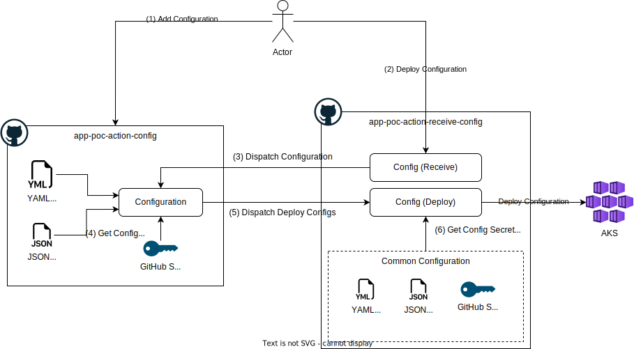

# App POC Receive Configuration and GitHub Secret

This is example for POC to get Configuration and Get secret from other resposities.

## Diagram

## Repositories

- [app-poc-action-config](https://github.com/tarathep/app-poc-action-config) this repo is store configs and secret only (specific by application).

- [app-poc-action-receive-config](https://github.com/tarathep/app-poc-action-receive-config) this repo for centrialize for combine common config and deploy to resource targets.

## Steps

1. User add Configuration files and Secret into app-poc-action-config
2. User run action to deploy application to target.